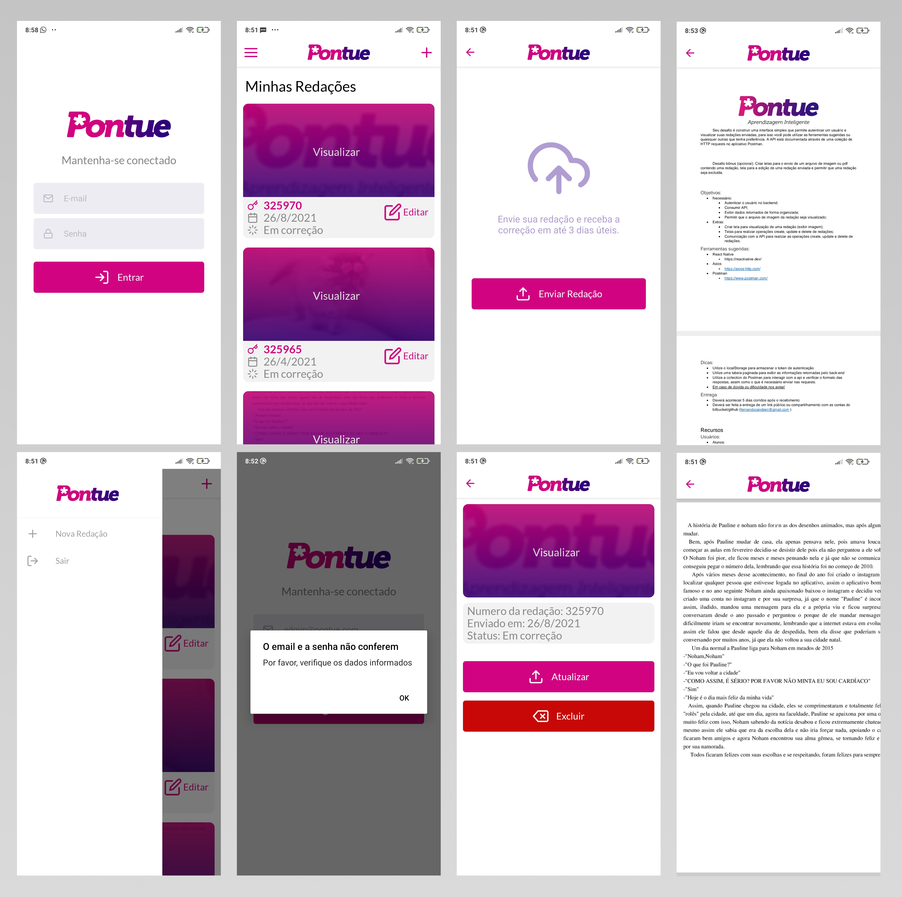

# Pontue App

Aplicativo para o desafio técnico da Pontue.

# Screenshots



## Instalação

### Clone do repositório

```bash
$ https://github.com/LuisPeixoto/pontue

$ cd pontue
```

### Instalação das dependências

```bash
$ yarn install
```

### Execução

```bash
$ yarn android
```